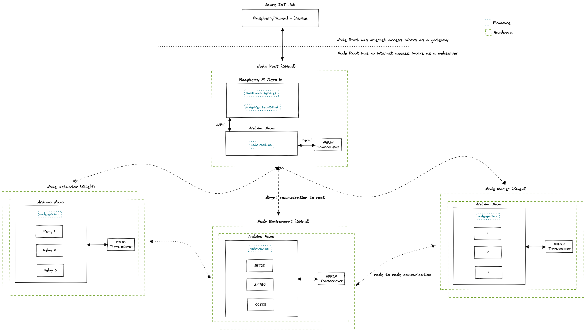

## Green IoT 4 All
This project is based on the idea to create low cost opensource IoT sensors and actuators for environmental purposes. They should run in testing environment, for private use or depending on the people participating even grow to a little nice product anyone can use. Since i am not reinventing the wheel here, a great shout out goes to all the opensource contributers working on Arduino and Raspberry Pi and all the other great stuff.

Lets have a look on the basic idea! 

The central Node (Node: Piece of hard- & sortware doing one specific job) is the Root Node (Server Node). The Root Node collects the data and works as a gateway to the cloud. It is (should be) also possible to operate without internet access. Then it is working as a hotspot where you can connect to and have access to a web interface.

Besides the Root Node there are three major types of other Nodes (Client Nodes): Environment, Water and Actuator Node. So far the Environment Node is ready as a prototype and measures these five values: light intesitiy, humidity, temperature and gas quality (CO2 and VOC). The other two Nodes must be still designed. 

The Node communication is based on the NRF24 transmitter module. Here we are using the great NRF24 network lib, which enables us to span a network between the nodes and always be able to transport the data to the root node (This still needs a stress test since i am just working with 2 Nodes at the moment. But i already tried it with three nodes and client to client to server node communication).
## Requirements

Get your hardware together, flash your Arduinos, set up your Pi and off you go! 

### Hardware

For the Environment Node you need the following:
- [Arduino Nano](https://www.amazon.de/AZDelivery-Atmega328-gratis-Arduino-kompatibel/dp/B078SBBST6/ref=sr_1_3?__mk_de_DE=ÅMÅŽÕÑ&dchild=1&keywords=Arduino+nano&qid=1616487341&sr=8-3)
- [NRF24](https://www.amazon.de/AZDelivery-NRF24L01-Wireless-Arduino-Raspberry/dp/B06XJN417D/ref=sr_1_1_sspa?__mk_de_DE=ÅMÅŽÕÑ&crid=3CWF8YKB82U61&keywords=NRF24&qid=1647773505&sprefix=nrf24%2Caps%2C81&sr=8-1-spons&psc=1&smid=A1X7QLRQH87QA3&spLa=ZW5jcnlwdGVkUXVhbGlmaWVyPUExOU9QRDBBRDZXVUtNJmVuY3J5cHRlZElkPUEwODY3ODMzTUgyT1ZTRzRMQThMJmVuY3J5cHRlZEFkSWQ9QTAxMTYzOThETks5TU9DWjAzRVYmd2lkZ2V0TmFtZT1zcF9hdGYmYWN0aW9uPWNsaWNrUmVkaXJlY3QmZG9Ob3RMb2dDbGljaz10cnVl) radio transmitter
- [AHT20](https://www.digikey.de/de/products/detail/adafruit-industries-llc/4566/12396895?utm_adgroup=Evaluation%20Boards%20-%20Expansion%20Boards%2C%20Daughter%20Cards&utm_source=google&utm_medium=cpc&utm_campaign=Shopping_Product_Development%20Boards%2C%20Kits%2C%20Programmers_Returning&utm_term=&productid=12396895&gclid=CjwKCAjwoduRBhA4EiwACL5RPz9I1AyRmXYULpqFdMFsBt8JcVPtelJ8Xrqdz0pHjbfnsiqXQkHLThoC2Z4QAvD_BwE) humidity and temperature sensor
- [BH1750](https://www.amazon.de/AZDelivery-GY-302-Helligkeitsensor-Arduino-Raspberry/dp/B07TKWNGZ4/ref=sr_1_3?__mk_de_DE=ÅMÅŽÕÑ&crid=16VWDXFS7YZ96&keywords=bh+1750&qid=1647773715&sprefix=bh1750%2Caps%2C225&sr=8-3) light sensor
- [CCS811](https://www.amazon.de/Vaorwne-CJMCU-811-Qualit？T-Numerische-Sensoren/dp/B08BWL1L97/ref=sr_1_7?__mk_de_DE=ÅMÅŽÕÑ&crid=13BAZN0XHD0O5&keywords=CCS811&qid=1647773748&sprefix=ccs811%2Caps%2C73&sr=8-7) gas sensor
- Either print the node-env-shield via EasyEDA or use a breadboard to connect allsensors (cables and breadboard is not listed here)

#### For the Root Node you need the following:
- [Raspberry Pi Zero W](https://www.reichelt.de/de/de/raspberry-pi-zero-2-w-4x-1-ghz-512-mb-ram-wlan-bt-rasp-pi-zero2-w-p313902.html?PROVID=2788&gclid=CjwKCAjwiuuRBhBvEiwAFXKaNLF7tvI48TUThVGy3qs2dCKXeFIVZCKTx82qTqWBBAUfXMqyGoIoPBoCbLwQAvD_BwE&&r=1) and SD Card
- [Arduino Nano](https://www.amazon.de/AZDelivery-Atmega328-gratis-Arduino-kompatibel/dp/B078SBBST6/ref=sr_1_3?__mk_de_DE=ÅMÅŽÕÑ&dchild=1&keywords=Arduino+nano&qid=1616487341&sr=8-3)
- [NRF24](https://www.amazon.de/AZDelivery-NRF24L01-Wireless-Arduino-Raspberry/dp/B06XJN417D/ref=sr_1_1_sspa?__mk_de_DE=ÅMÅŽÕÑ&crid=3CWF8YKB82U61&keywords=NRF24&qid=1647773505&sprefix=nrf24%2Caps%2C81&sr=8-1-spons&psc=1&smid=A1X7QLRQH87QA3&spLa=ZW5jcnlwdGVkUXVhbGlmaWVyPUExOU9QRDBBRDZXVUtNJmVuY3J5cHRlZElkPUEwODY3ODMzTUgyT1ZTRzRMQThMJmVuY3J5cHRlZEFkSWQ9QTAxMTYzOThETks5TU9DWjAzRVYmd2lkZ2V0TmFtZT1zcF9hdGYmYWN0aW9uPWNsaWNrUmVkaXJlY3QmZG9Ob3RMb2dDbGljaz10cnVl) radio transmitter
- Either print the node-root-shield via EasyEDA or use a breadboard to connect allsensors (cables and breadboard is not listed here)

### Software
- [EasyEDA](https://easyeda.com)
- [Rust](https://www.rust-lang.org/tools/install) (since we are developing for the Pi, you wont be able to run the Rust code directly on your machine. Always get the newest debian package on your Pi and debug there)
- [Arduino](https://www.arduino.cc/en/software) (All required libs you can find in firmware/arduino-nano/lib. Both Arduino should be debuggable via you machine)
- Not required! ([JFrog artifactory](https://greeniot4all.jfrog.io/ui/packages) for Debian registry)
- [Docker](https://hub.docker.com/r/fabianbruenger/greeniot4all) as container registry for cross compile images
- [Node-Red](https://nodered.org/docs/getting-started/)
- Azure IoT Hub (there is a free testing tier: F1, but of course you need an Azure Account for the set up)

## Set Up

### Raspberry Pi
1. Configure the SD card with Raspberry image app. Install the std image. Congirue pi in headless mode
2. Create an empty ssh for ssh enablement while boot
3. Create the wsp file with wlan configs https://www.raspberrypi.org/documentation/configuration/wireless/headless.md
4. Start the pi, check connection in local wlan and connect to pi via ssh: ssh pi@<ip-address> (raspberry)
5. Increase the [swap size](https://wpitchoune.net/tricks/raspberry_pi3_increase_swap_size.html)
6. Get the latest release of the debian packages via Github and install them
6. Not required! (Set up pi as hotspot [Hotspot](https://www.raspberryconnect.com/projects/65-raspberrypi-hotspot-accesspoints/158-raspberry-pi-auto-wifi-hotspot-switch-direct-connection))
7. Not required! ([Save OS image](https://howchoo.com/pi/create-a-backup-image-of-your-raspberry-pi-sd-card-in-mac-osx))

### Azure IoT Hub
1. Create a free tier Azure IoT Hub in one resource group
2. On Azure IoT Hub create a device with name RaspberryPiLocal
3. Get the connection string with: `az iot hub connection-string show`
4. Add the HostName to ms01config.toml l.5 
5. Add the Primary Key of device to ms01config.toml l.9

## Notes
#### Local Dev
- `docker cp . <image-name>:/opt/greeniot4all`
- `docker exec -ti <image-name> sh -c "cd /opt/greeniot4all/firmware/raspberry-pi-zero-w/<project> && cargo build --release --target arm-unknown-linux-gnueabi (--output /opt/build/<project>.deb)"`
- `docker exec -ti <image-name> sh -c "scp /opt/greeniot4all/firmware/raspberry-pi-zero-w/<project>/target/arm-unknown-linux-gnueabi/release/ms-02-data-collector pi@<IP-address>:/home/pi"`
- `systemctl status service-name.service`
- `journalctl -u service-name.service -f`
- Node-red: Changin favicon: https://gist.github.com/mohnen/6923d5eb2e4547bb7e5bd90546d2ee80

### Donation
[Support](https://www.paypal.com/donate/?hosted_button_id=M6QRBT6Y5YB72) the project

