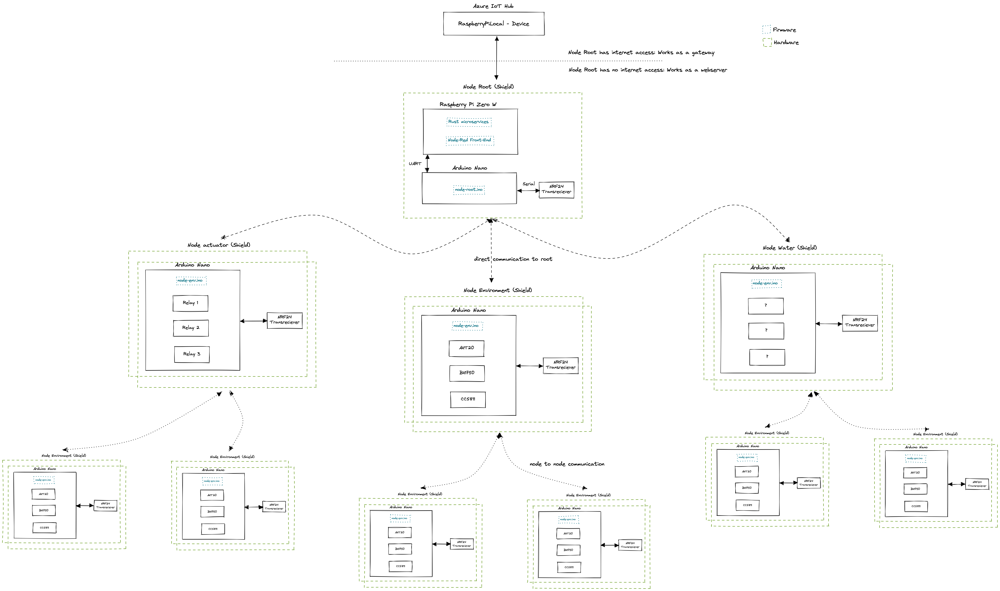

## Green IoT 4 All
This project is based on the idea to create low cost opensource IoT sensors and actuators for environmental purposes. They should run in testing environment, for private use or depending on the people participating even grow to a little nice product anyone can use. Since i am not reinventing the wheel here, a great shout out goes to all the opensource contributers working on Arduino and Raspberry Pi and all the other great stuff.

Lets have a look on the basic idea! 

The central Node (Node: Piece of hard- & sortware doing one specific job) is the Root Node (Server Node). The Root Node collects the data and works as a gateway to the cloud. It is (should be) also possible to operate without internet access. Then it is working as a hotspot where you can connect to and have access to a web interface.

Besides the Root Node there are three major types of other Nodes (Client Nodes): Environment, Water and Actuator Node. So far the Environment Node is ready as a prototype and measures these five values: light intesitiy, humidity, temperature and gas quality (CO2 and VOC). The other two Nodes must be still designed. 

The Node communication is based on the NRF24 transmitter module. Here we are using the great NRF24 network lib, which enables us to span a network between the nodes and always be able to transport the data to the root node (This still needs a stress test since i am just working with 2 Nodes at the moment. But i already tried it with three nodes and client to client to server node communication).
## Requirements

Get your hardware together, flash your Arduinos, set up your Pi and off you go! 

### Hardware

For the Environment Node you need the following:
- [Arduino Nano](https://www.amazon.de/AZDelivery-Atmega328-gratis-Arduino-kompatibel/dp/B078SBBST6/ref=sr_1_3?__mk_de_DE=ÅMÅŽÕÑ&dchild=1&keywords=Arduino+nano&qid=1616487341&sr=8-3)
- [NRF24](https://www.amazon.de/AZDelivery-NRF24L01-Wireless-Arduino-Raspberry/dp/B06XJN417D/ref=sr_1_1_sspa?__mk_de_DE=ÅMÅŽÕÑ&crid=3CWF8YKB82U61&keywords=NRF24&qid=1647773505&sprefix=nrf24%2Caps%2C81&sr=8-1-spons&psc=1&smid=A1X7QLRQH87QA3&spLa=ZW5jcnlwdGVkUXVhbGlmaWVyPUExOU9QRDBBRDZXVUtNJmVuY3J5cHRlZElkPUEwODY3ODMzTUgyT1ZTRzRMQThMJmVuY3J5cHRlZEFkSWQ9QTAxMTYzOThETks5TU9DWjAzRVYmd2lkZ2V0TmFtZT1zcF9hdGYmYWN0aW9uPWNsaWNrUmVkaXJlY3QmZG9Ob3RMb2dDbGljaz10cnVl) radio transmitter
- [AHT20](https://www.digikey.de/de/products/detail/adafruit-industries-llc/4566/12396895?utm_adgroup=Evaluation%20Boards%20-%20Expansion%20Boards%2C%20Daughter%20Cards&utm_source=google&utm_medium=cpc&utm_campaign=Shopping_Product_Development%20Boards%2C%20Kits%2C%20Programmers_Returning&utm_term=&productid=12396895&gclid=CjwKCAjwoduRBhA4EiwACL5RPz9I1AyRmXYULpqFdMFsBt8JcVPtelJ8Xrqdz0pHjbfnsiqXQkHLThoC2Z4QAvD_BwE) humidity and temperature sensor
- [BH1750](https://www.amazon.de/AZDelivery-GY-302-Helligkeitsensor-Arduino-Raspberry/dp/B07TKWNGZ4/ref=sr_1_3?__mk_de_DE=ÅMÅŽÕÑ&crid=16VWDXFS7YZ96&keywords=bh+1750&qid=1647773715&sprefix=bh1750%2Caps%2C225&sr=8-3) light sensor
- [CCS811](https://www.amazon.de/Vaorwne-CJMCU-811-Qualit？T-Numerische-Sensoren/dp/B08BWL1L97/ref=sr_1_7?__mk_de_DE=ÅMÅŽÕÑ&crid=13BAZN0XHD0O5&keywords=CCS811&qid=1647773748&sprefix=ccs811%2Caps%2C73&sr=8-7) gas sensor
- Either print the node-env-shield via EasyEDA or use a breadboard to connect allsensors (cables and breadboard is not listed here)

#### For the Root Node you need the following:
- [Raspberry Pi Zero W](https://www.reichelt.de/de/de/raspberry-pi-zero-2-w-4x-1-ghz-512-mb-ram-wlan-bt-rasp-pi-zero2-w-p313902.html?PROVID=2788&gclid=CjwKCAjwiuuRBhBvEiwAFXKaNLF7tvI48TUThVGy3qs2dCKXeFIVZCKTx82qTqWBBAUfXMqyGoIoPBoCbLwQAvD_BwE&&r=1) and SD Card
- [Arduino Nano](https://www.amazon.de/AZDelivery-Atmega328-gratis-Arduino-kompatibel/dp/B078SBBST6/ref=sr_1_3?__mk_de_DE=ÅMÅŽÕÑ&dchild=1&keywords=Arduino+nano&qid=1616487341&sr=8-3)
- [NRF24](https://www.amazon.de/AZDelivery-NRF24L01-Wireless-Arduino-Raspberry/dp/B06XJN417D/ref=sr_1_1_sspa?__mk_de_DE=ÅMÅŽÕÑ&crid=3CWF8YKB82U61&keywords=NRF24&qid=1647773505&sprefix=nrf24%2Caps%2C81&sr=8-1-spons&psc=1&smid=A1X7QLRQH87QA3&spLa=ZW5jcnlwdGVkUXVhbGlmaWVyPUExOU9QRDBBRDZXVUtNJmVuY3J5cHRlZElkPUEwODY3ODMzTUgyT1ZTRzRMQThMJmVuY3J5cHRlZEFkSWQ9QTAxMTYzOThETks5TU9DWjAzRVYmd2lkZ2V0TmFtZT1zcF9hdGYmYWN0aW9uPWNsaWNrUmVkaXJlY3QmZG9Ob3RMb2dDbGljaz10cnVl) radio transmitter
- Either print the node-root-shield via EasyEDA or use a breadboard to connect allsensors (cables and breadboard is not listed here)

#### Add Ons
- SD Card reader
- 2 USB mini cables
- 1 USB micro cable
- Develop machine
- Micro HDMI cable (just in case you need to check the Pi directly)
### Software
- [EasyEDA](https://easyeda.com)
- [Rust](https://www.rust-lang.org/tools/install) (since we are developing for the Pi, you wont be able to run the Rust code directly on your machine. Always get the newest debian package on your Pi and debug there)
- [Arduino](https://www.arduino.cc/en/software) (All required libs you can find in firmware/arduino-nano/lib. Both Arduino should be debuggable via you machine)
- [Docker](https://hub.docker.com/r/fabianbruenger/greeniot4all) as container registry for cross compile images
- [Node-Red](https://nodered.org/docs/getting-started/) will be used as front end dev develoment on the Pi until it is replaced by Rust microservice
- Azure IoT Hub (there is a free testing tier: F1, but of course you need an Azure Account for the set up)
- [Raspberry Pi Image manager](https://www.raspberrypi.com/software/)

## Set Up

### Environment Node
I would start with the Environment Node since you can debug it and set it up the easiest way. If you got the PCB mounting shield from hardware/node-env-shield via easyEDA (cloud), you will have an easy job to mount everything on: 3 sensors, the transreciever and the Arduino Nano. Then you can flash your Arduino with the firmware/arduino-nano/node-env.ino. You might need to import the libs as well if you dont have them installed already. 
After opening the serial monitor you should see this:

### Root Node

After setting up the Environment Node you can continue with the Root Node's Arduino. Again, if you also printed the PCB mounting shield from hardware/node-root-shield via easyEDA you will have an easy job. Just connect the transreciever and the Arduino, flash the firmware from firmware/arduino-nano/node-root.ino and debug the device. While you have the other Arduino still running, you should now see the recieved sensor values from the Environment Node.

Here it can be, that not all the sensor data are recieved in the right order or are displayed well. Sometimes it happens to be a bit fickle. But lets have a short look on one transmitted string: 
`S0001:05{2.00}E`

I will shortly dig into the transmitting rules i came up with. The above string represents one transmitted sensor value. The "S" is representing the start of the package, while the "E" is representing the end of the package. Think of it as a start and stop byte. The next 4 numbers/bytes are telling you from which node the value is coming from, the Node number: 0001. This is based on the NRF24network library, which has a specific lableing of the nodes in the radio network. Important is, that there must always be only one Node represented by one number. This config is corresbondig with firmware/raspberry-pi-zero-w/ms-02-data-collector/config/sensor-data.json. 
The two bytes after the colon represents the sensor number. Within the tail clips there is the actual sensor value as floating point. 

### Raspberry Pi
After you varified the Root Node's Arduino, you are ready to set up the Pi.

1. Configure the SD card with Raspberry Pi Image manager and nstall the std image. Congirue pi in headless mode (2. and 3.; this will make you Pi connect directly to your home network)
2. On the SD Card, after flashing Pi OS: Create an empty ssh for ssh enablement while boot
3. Create the wsp file with wlan configs https://www.raspberrypi.org/documentation/configuration/wireless/headless.md
4. Start the pi, check connection in local wlan and connect to pi via ssh: ssh pi@<ip-address> (raspberry)
5. Increase the [swap size](https://wpitchoune.net/tricks/raspberry_pi3_increase_swap_size.html)
6. Get the latest release of the debian packages via Github and install them
6. Not required! (Set up pi as hotspot [Hotspot](https://www.raspberryconnect.com/projects/65-raspberrypi-hotspot-accesspoints/158-raspberry-pi-auto-wifi-hotspot-switch-direct-connection))
7. Not required but recommended! ([Save OS image](https://howchoo.com/pi/create-a-backup-image-of-your-raspberry-pi-sd-card-in-mac-osx))

After you have done all the steps, mount the Pi on the shield as well. Now log in via ssh to your Pi and check the two services. Check first if the ms-02-data-collector service is running (Reads the data via UART from the Arduino) with `systemctl status ms-02-data-collector.service`.

If you want to use the ms-01-azure-gateway service as well, you need a valid Azure IoT HUb set up, otherwise the service wont start. If you having problems of recieving data with the ms-02-data-collector service, restart the Arduinos, make sure that you have no serial monitor on Arduino running (best close Arduino) and get the sensors on the Environment Node busy.

### Azure IoT Hub
1. Create a free tier Azure IoT Hub in one resource group
2. On Azure IoT Hub create a device with name RaspberryPiLocal
3. Get the connection string with: `az iot hub connection-string show`
4. Add the HostName to ms01config.toml l.5 
5. Add the Primary Key of device to ms01config.toml l.9

## Participate!
This is an open source project, and although i invested a lot of time in it there is so much stuff to do and so much room for improvement. So, if you have in general a lot of free time or if you are interested in one of the topics this project is covering, you are more than welcome! Just have a look on the [open issues](https://github.com/FabianBruenger/green-iot-4all/issues). These topics need your imput!
1. Embedded development C/C++/ArduinoRust: help with working on the Arduino network radio transreccieving structure; do some stress test regarding node quantity, data transmitting rate; trying new boards; bring more quality to the Rust microservices; devlop new services (Frontend/light webserver)
2. Hardware development easyEDA/KiCAD/other some othe IDE i dont know about: help to create our own PCBs with all sensors and MCUs mounted to one product; work on the other two Nodes in pipeline: Water and Actuator Node
3. Product design 3D printing: help of building handy and robust cases for the hardware
4. Or work on topics you see and want to discuss or contribute! 

### Donation
[Support](https://www.paypal.com/donate/?hosted_button_id=M6QRBT6Y5YB72) the project

